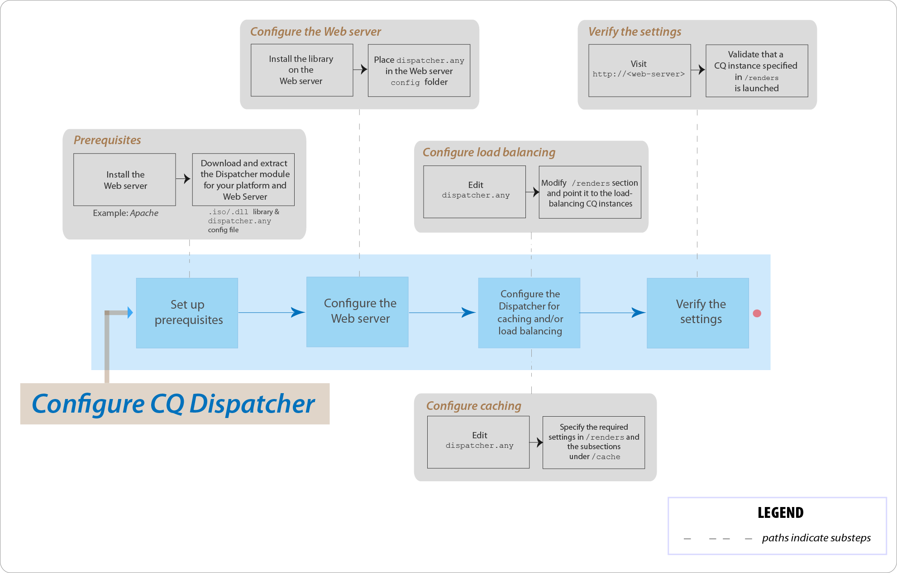

# AEM Dispatcher常见问题解答



## 简介

### 什么是Dispatcher?

Dispatcher是Adobe Experience Manager的缓存和/或负载平衡工具，可帮助实现快速、动态的Web创作环境。 对于缓存，Dispatcher作为HTTP服务器（如Apache）的一部分工作，其目的是尽可能多地存储（或“缓存”）静态网站内容，并尽可能少地访问网站的布局引擎。 在负载平衡角色中，Dispatcher在不同的AEM实例（呈现）间分发用户请求（负载）。

对于缓存，Dispatcher模块使用Web服务器的功能来提供静态内容。 Dispatcher将缓存的文档放在Web服务器的文档根目录中。

### Dispatcher如何执行缓存？

Dispatcher使用Web服务器的功能来提供静态内容。 Dispatcher将缓存的文档存储在Web服务器的文档根目录中。 Dispatcher 有两种主要方法可用于在对网站进行更改后更新缓存内容。

* **内容更新**&#x200B;可删除已更改的页面以及与其直接关联的文件。
* **自动失效**&#x200B;可在更新后自动使可能已过期的这部分缓存失效。例如，它可以有效地将相关页面标记为已过期，而不会删除任何内容。

### 负载平衡有哪些好处？

负载平衡在多个AEM实例中分发用户请求（负载）。以下列表描述了负载平衡的优势：

* **增强的处理能力**:在实践中，这意味着Dispatcher在多个AEM实例之间共享文档请求。由于每个实例处理的文档较少，因此响应时间更快。 Dispatcher 保留每个文档类别的内部统计信息，以便能够估计负载并高效分发查询。
* **增加了故障保护范围**:如果Dispatcher未收到来自实例的响应，它将自动将请求中继到另一个实例中的一个。因此，如果一个实例变得不可用，唯一的结果就是站点速度减慢，这与计算能力损失成正比。

>[!NOTE]
>
>有关更多详细信息，请参阅[Dispatcher概述页面](dispatcher.md)

## 安装和配置

### 我应从何处下载Dispatcher模块？

您可以从[Dispatcher发行说明](release-notes.md)页面下载最新的Dispatcher模块。

### 如何安装Dispatcher模块？

请参阅[安装Dispatcher](dispatcher-install.md)页面

### 如何配置Dispatcher模块？

请参阅[配置Dispatcher](dispatcher-configuration.md)页面。

### 如何为创作实例配置Dispatcher?

有关详细步骤，请参阅[将Dispatcher与创作实例一起使用](dispatcher.md#using-a-dispatcher-with-an-author-server)。

### 如何使用多个域配置Dispatcher?

您可以使用多个域配置CQ Dispatcher，前提是这些域满足以下条件：

* 两个域的Web内容都存储在单个AEM存储库中
* Dispatcher缓存中的文件对于每个域可单独失效

有关更多详细信息，请参阅[将Dispatcher与多个域结合使用](dispatcher-domains.md) 。

### 如何配置Dispatcher，以便将用户的所有请求路由到同一发布实例？

您可以使用[置顶连接](dispatcher-configuration.md#identifying-a-sticky-connection-folder-stickyconnectionsfor)功能，该功能可确保用户的所有文档都在AEM的同一实例上处理。 如果您使用个性化页面和会话数据，则此功能很重要。 数据存储在实例上。 因此，来自同一用户的后续请求必须返回到该实例，否则数据将丢失。

由于粘性连接会限制Dispatcher优化请求的能力，因此仅在必要时才应使用此方法。 您可以指定包含“粘滞”文档的文件夹，从而确保该文件夹中的所有文档都在用户的同一实例上进行处理。

### 我是否可以将粘性连接和缓存结合使用？

对于使用粘性连接的大多数页面，应关闭缓存。 否则，无论会话内容如何，都会向所有用户显示该页面的同一实例。

对于某些应用程序，可以同时使用粘性连接和缓存。 例如，如果显示将数据写入会话的表单，则可以同时使用粘性连接和缓存。

### 调度程序和AEM发布实例是否可以驻留在同一物理计算机上？

是的，如果机器足够强大。 但是，建议您在不同的计算机上设置Dispatcher和AEM Publish实例。

通常，发布实例位于防火墙内，调度程序位于DMZ内。 如果您决定将发布实例和调度程序都位于同一物理计算机上，请确保防火墙设置禁止从外部网络直接访问发布实例。

### 我是否可以仅缓存具有特定扩展名的文件？

是. 例如，如果只想缓存GIF文件，请在dispatcher.any配置文件的缓存部分中指定*.gif。

### 如何从缓存中删除文件？

您可以使用HTTP请求从缓存中删除文件。 收到HTTP请求后，Dispatcher将从缓存中删除文件。 仅当Dispatcher收到页面的客户端请求时，才会再次缓存文件。 以这种方式删除缓存文件对于不太可能同时收到同一页面请求的网站是合适的。

HTTP请求具有以下语法：

```
POST /dispatcher/invalidate.cache HTTP/1.1
CQ-Action: Activate
CQ-Handle: path-pattern
Content-Length: 0
```

Dispatcher将删除名称与CQ-Handle标头值匹配的缓存文件和文件夹。 例如，`/content/geomtrixx-outdoors/en`的CQ-Handle匹配以下项：

在geometrixx-outdoors目录中名为en的所有文件（任何文件扩展名的）
en目录下任何名为`_jcr_content`的目录（如果存在，则包含页面子节点的缓存渲染）
仅当`CQ-Action`为`Delete`或`Deactivate`时，才会删除目录en。

有关本主题的更多详细信息，请参阅[手动使调度程序缓存失效](page-invalidate.md)。

### 如何实施权限敏感型缓存？

请参阅[缓存安全内容](permissions-cache.md)页面。

### 如何保护Dispatcher与CQ实例之间通信的安全？

请参阅[Dispatcher安全检查表](security-checklist.md)和[AEM安全检查表](https://helpx.adobe.com/experience-manager/6-4/sites/administering/using/security-checklist.html)页面。

### 调度程序问题`jcr:content`更改为`jcr%3acontent`

**问题**:我们最近在调度程序级别遇到了一个问题，即ajax调用中的一个问题，该调用正在获取CQ存储库中包含的某 `jcr:content` 些数据，并且进行了编码以 `jcr%3acontent` 导致错误的结果集。

**答案**:请使 `ResourceResolver.map()` 用方法获取要使用/发出的获取请求的“友好”URL，并解决Dispatcher的缓存问题。map()方法将`:`冒号编码为下划线，resolve()方法会将其解码为SLING JCR可读格式。您需要使用map()方法生成Ajax调用中使用的URL。

进一步阅读：[https://sling.apache.org/documentation/the-sling-engine/mappings-for-resource-resolution.html#namespace-mangling](https://sling.apache.org/documentation/the-sling-engine/mappings-for-resource-resolution.html#namespace-mangling)

## 刷新调度程序

### 如何在发布实例上配置调度程序刷新代理？

请参阅[Replication](https://helpx.adobe.com/content/help/en/experience-manager/6-4/sites/deploying/using/replication.html#ConfiguringyourReplicationAgents)页面。

### 如何对Dispatcher刷新问题进行故障诊断？

[请参阅本疑难解答文](https://helpx.adobe.com/content/help/en/experience-manager/kb/troubleshooting-dispatcher-flushing-issues.html) 章，以回答以下问题：

* 如何调试Dispatcher缓存中未保存任何内容的情况？
* 如何调试缓存文件未更新的情况？
* 如何调试与调度程序刷新无关的情况？

如果删除操作导致Dispatcher刷新，请[使用Sensei Martin](https://mkalugin-cq.blogspot.in/2012/04/i-have-been-working-on-following.html)在此社区博客文章中的解决方法。

### 如何从调度程序缓存刷新DAM资产？

您可以使用“链式复制”功能。  启用此功能后，当从作者处收到复制时，调度程序刷新代理会发送刷新请求。

要启用它，请执行以下操作：

1. [按照以下步骤](page-invalidate.md#invalidating-dispatcher-cache-from-a-publishing-instance) 在发布时创建刷新代理
1. 转到这些代理的每个配置，并在&#x200B;**Triggers**&#x200B;选项卡中选中&#x200B;**On Receive**&#x200B;框。

## 其他

Dispatcher如何确定文档是否为最新？
为确定文档是否为最新，Dispatcher会执行以下操作：

它检查文档是否遵循自动失效机制。如果不遵循，则该文档是最新状态。如果该文档配置为自动失效，则 Dispatcher 检查它比最后一次可用更改旧还是新。如果较旧，则 Dispatcher 从 AEM 实例请求当前版本，并替换缓存中的版本。

### Dispatcher如何返回文档？

您可以使用[Dispatcher配置](dispatcher-configuration.md)文件`dispatcher.any`来定义Dispatcher是否缓存文档。 Dispatcher 根据可缓存文档列表检查请求。如果文档不在此列表中，则 Dispatcher 从 AEM 实例中请求该文档。

`/rules`属性控制根据文档路径缓存哪些文档。 无论`/rules`属性如何，Dispatcher在以下情况下都永远不会缓存文档：

* 如果请求URI包含问号`(?)`。
* 这通常表示动态页面，例如不需要缓存的搜索结果。
* 缺失文件扩展名。
* Web 服务器需要扩展名来确定文档类型（比如 MIME 类型）。
* 设置了身份验证标头（此项可进行配置）
* 如果AEM实例使用以下标头做出响应：
   * 无缓存
   * 无存储
   * 必须重新验证

Dispatcher将缓存文件存储在Web服务器上，就像它们是静态网站的一部分。 如果用户请求缓存的文档，则Dispatcher检查该文档是否存在于Web服务器的文件系统中。 如果是，则Dispatcher返回文档。 如果没有，则Dispatcher从AEM实例请求文档。

>[!NOTE]
>
>GET 或 HEAD（针对 HTTP 标头）方法可由 Dispatcher 缓存。有关响应标头缓存的其他信息，请参阅[缓存HTTP响应标头](dispatcher-configuration.md#caching-http-response-headers)一节。

### 我能否在设置中实施多个Dispatcher?

是. 在这种情况下，请确保两个Dispatcher都可以直接访问AEM网站。 Dispatcher无法处理来自其他Dispatcher的请求。
