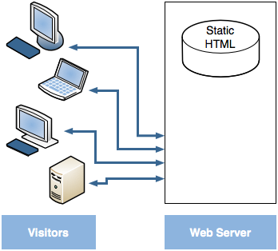
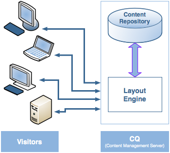
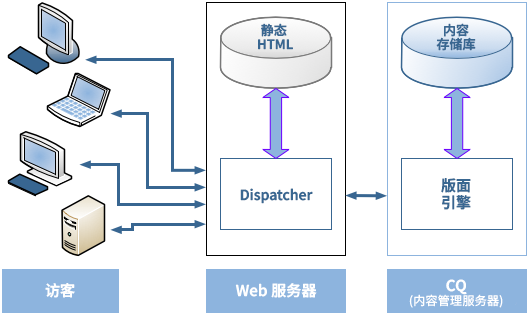
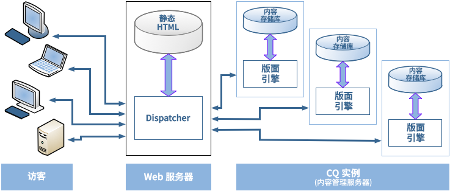

# Dispatcher 概述 {#dispatcher-overview}

>[!NOTE]
>
>Dispatcher 版本独立于 AEM (Adobe Experience Manager)。如果您点击了 Dispatcher 文档的链接，则可能重定向到此页面。该链接嵌入在 AEM 先前版本的文档中。

Dispatcher 是 Adobe Experience Manager 与企业级 Web 服务器结合使用的缓存和负载平衡工具。

部署 Dispatcher 的过程与所选的 Web 服务器和操作系统平台无关：

1. 了解 Dispatcher（此页面）。另请参阅[有关 Dispatcher 的常见问题解答](/help/using/dispatcher-faq.md)。
1. 按照 Web 服务器文档安装[支持的 Web 服务器](https://experienceleague.adobe.com/zh-hans/docs/experience-manager-65/content/implementing/deploying/introduction/technical-requirements)。
1. 在 Web 服务器上[安装 Dispatcher 模块](dispatcher-install.md)，并相应地配置 Web 服务器。
1. [配置 Dispatcher](dispatcher-configuration.md)（dispatcher.any 文件）。
1. [配置 AEM](page-invalidate.md)，以便内容更新后，使缓存失效。

>[!NOTE]
>
>要更好地了解如何将 Dispatcher 与 AEM 配合使用，请执行以下操作：
>
>* 参阅 [2017 年 7 月版 AEM 社区专家疑难解答](https://communities.adobeconnect.com/pf0gem7igw1f/)。
>* 访问[此存储库](https://github.com/adobe/aem-dispatcher-experiments)。它包含一系列“家用版”实验室格式的实验。


根据需要使用以下信息：

* [Dispatcher 安全核对清单](security-checklist.md)
<!-- URL is 404! * [The Dispatcher Knowledge Base](https://helpx.adobe.com/experience-manager/kb/index/dispatcher.html) -->
* [优化网站以提升缓存性能](https://experienceleague.adobe.com/zh-hans/docs/experience-manager-65/content/implementing/deploying/configuring/configuring-performance)
* [在多个域中使用 Dispatcher](dispatcher-domains.md)
* [将 SSL 与 Dispatcher 结合使用](dispatcher-ssl.md)
* [实施权限敏感型缓存](permissions-cache.md)
* [Dispatcher 问题疑难解答](dispatcher-troubleshooting.md)
* [Dispatcher 常见问题解答](dispatcher-faq.md)

>[!NOTE]
>
>**Dispatcher 最常见的用法**&#x200B;是缓存来自 AEM **发布实例**&#x200B;的响应，从而提高面向外部发布的网站的响应速度和安全性。大部分讨论主要介绍这种情况。
>
>但是，Dispatcher 还可用于提高&#x200B;**作者实例**&#x200B;的响应速度。事实确实如此，尤其是在有大量用户编辑和更新网站的情况下。有关这种情况的详细信息，请参阅下面的[将 Dispatcher 与作者服务器一起使用](#using-a-dispatcher-with-an-author-server)。

## 为何使用 Dispatcher 来实施缓存？ {#why-use-dispatcher-to-implement-caching}

有两种基本方法可进行 Web 发布：

* **静态 Web 服务器**：例如 Apache 或 IIS，简易，但速度快。
* **内容管理服务器**：提供动态、实时、智能的内容，但需要更多的计算时间和其他资源。

Dispatcher 可帮助实现既快速又动态的环境。它在静态 HTML 服务器（比如 Apache）中使用的目的是：

* 以静态网站的形式尽可能多地存储（“缓存”）站点内容
* 尽可能少地访问布局引擎。

这意味着：

* 如同在静态 Web 服务器上一样快速而简便地处理&#x200B;**静态内容**。此外，还可使用为静态 Web 服务器提供的管理和安全工具。

* 根据需要生成&#x200B;**动态内容**，完全没有必要再减慢系统速度。

Dispatcher 包含根据动态站点内容生成和更新静态 HTML 的机制。您可以详细指定将哪些文档存储为静态文件，哪些文档始终通过动态方式生成。

此部分阐明此过程背后的原理。

### 静态 Web 服务器 {#static-web-server}



一个静态 Web 服务器（如 Apache 或 IIS）为网站的访客提供静态 HTML 文件。仅创建一次静态页面，因此对于每个请求都传送相同的内容。

此过程简单而又高效。如果访客请求某个文件（如 HTML 页面），则直接从内存取得该文件；在最差的情况下，从本地驱动器读取它。静态 Web 服务器已经出现很长一段时间了。 因此，管理和安全管理工具种类繁多。这些工具与网络基础设施结合得很好。

### 内容管理服务器 {#content-management-servers}



如果使用 CMS（全称为内容管理服务器，如 AEM），则有一个先进的布局引擎处理来自访客的请求。该引擎从存储库读取内容，并与样式、格式和访问权限相结合，将内容转换为专门根据访客的需求和权利定制的文档。

通过此工作流，可创建更丰富的动态内容，从而提高网站的灵活性和功能性。但是，布局引擎需要比静态服务器更大的处理能力，因此，如果许多访客同时使用系统，则此设置的速度可能会减慢。

## Dispatcher 如何执行缓存 {#how-dispatcher-performs-caching}



**缓存目录**：对于执行缓存，Dispatcher 模块利用 Web 服务器的功能来提供静态内容。Dispatcher 将缓存文档放在 Web 服务器的根目录下。

>[!NOTE]
>
>如果没有配置 HTTP 标头缓存，则 Dispatcher 仅存储页面的 HTML 代码 - 它不会存储 HTTP 标头。如果在网站内使用不同的编码，由于可能会丢失这些页面，所以此场景可能会成为一个问题。要启用 HTTP 标头缓存，请参阅[配置 Dispatcher 缓存](https://experienceleague.adobe.com/zh-hans/docs/experience-manager-dispatcher/using/configuring/dispatcher-configuration)。

>[!NOTE]
>
>将 Web 服务器的文档根目录放在网络连接存储 (NAS) 上导致性能下降。此外，如果在多个 Web 服务器之间共享位于 NAS 上的文档根目录，则执行复制操作时可能会出现间歇性锁定。

>[!NOTE]
>
>Dispatcher 在一个与所请求的 URL 相同的结构中存储缓存的文档。
>
>操作系统可能对文件名的长度有限制。也就是说，如果您的 URL 含有大量选择器。

### 缓存方法

Dispatcher 有两种主要的方法可在对网站作出更改时更新缓存内容。

* **内容更新**&#x200B;删除已更改的页面以及与其直接关联的文件。
* **自动失效**&#x200B;在更新后自动使缓存可能已过期的那些部分失效。也就是说，它实际上将相关的页面标为已过期，但不删除任何内容。

### 内容更新

在内容更新中，有一个或多个 AEM 文档发生了变更。AEM 向 Dispatcher 发送联合请求，以相应地更新缓存：

1. 它从缓存中删除修改过的文件。
1. 它从缓存中删除以相同句柄开头的所有文件。例如，如果更新了文件 `/en/index.html`，则会删除所有以 `/en/index.` 开头的文件。通过此机制，您可设计出缓存效率高的网站，尤其是涉及图片导航的网站。
1. 它“接触”**&#x200B;所谓的 **statfile**，这样将更新 statfile 的时间戳以指示上次更改的日期。

应注意以下几点：

* 内容更新一般与“知道”必须替换哪些内容的创作系统配合使用。
* 会删除受内容更新影响的文件，但不会立即替换。下次再请求此类文件时，Dispatcher 将从 AEM 实例获取新文件，并将其放置在缓存中，从而覆盖旧内容。
* 通常情况下，自动生成的图片（包含来自页面的文本）将存储在以相同句柄开头的图片文件中 - 从而确保存在关联以便于删除。例如，您可以将 mypage.html 页面的标题文本作为 mypage.titlePicture.gif 图片存储在相同的文件夹中。这样每次更新页面后就会自动从缓存中删除图片，您就可以确保图片始终反映页面的最新版本。
* 您可能有多个 statfile，例如每个语言文件夹一个。如果页面已更新，AEM 将查找包含 statfile 的下一个父文件夹，然后处理&#x200B;**&#x200B;该文件。

### 自动失效

自动失效可自动使部分缓存失效 - 不会实际删除任何文件。在每次内容更新时，都会处理所谓的 statfile，因此其时间戳记可以反映最新的内容更新日期。

Dispatcher 有一个遵循自动失效机制的文件列表。当请求该列表中的文档时，Dispatcher 会将缓存文档的日期与 statfile 的时间戳记进行比较：

* 如果缓存文档的日期较新，则 Dispatcher 将返回缓存文档。
* 如果日期较旧，则 Dispatcher 将从 AEM 实例中检索最新版本。

同样，应当注意这几点：

* 一般在互相之间的关系比较复杂（如 HTML 页面）时使用自动失效。这些页面包含链接和导航条目，因此在内容更新后一般必须更新这些页面。如果您有自动生成的 PDF 或图片文件，也可选择使这些文件自动失效。
* 除了接触 statfile 之外，自动失效并不涉及在更新时 Dispatcher 执行的任何操作。但是，接触 statfile 将自动使缓存内容过时，但并不真正地从缓存中删除内容。

## Dispatcher 如何返回文档 {#how-dispatcher-returns-documents}


### 确定某个文档是否需要缓存

您可以[在配置文件中定义 Dispatcher 缓存的文档](https://experienceleague.adobe.com/zh-hans/docs/experience-manager-dispatcher/using/configuring/dispatcher-configuration)。Dispatcher 根据可缓存文档列表检查请求。如果文档不在此列表中，则 Dispatcher 从 AEM 实例中请求该文档。

在以下情况下，Dispatcher 始终直接从 AEM 实例请求文档：

* 请求 URI 包含问号“`?`”。 此场景一般指示无需缓存的动态页面，如搜索结果。
* 缺失文件扩展名。Web 服务器需要扩展名以确定文档类型（MIME 类型）。
* 设置了身份验证标头（可配置）。

>[!NOTE]
>
>GET 或 HEAD（针对 HTTP 标头）方法可由 Dispatcher 缓存。有关响应标头缓存的其他信息，请参阅[缓存 HTTP 响应标头](https://experienceleague.adobe.com/zh-hans/docs/experience-manager-dispatcher/using/configuring/dispatcher-configuration)部分。

### 确定文档是否已缓存

Dispatcher 会将缓存文件存储在 Web 服务器上，就像它们是静态网站的一部分一样。如果用户请求一个可缓存的文档，则 Dispatcher 检查该文档是否存在于 Web 服务器的文件系统中：

* 如果文档已缓存，则 Dispatcher 返回该文件。
* 如果未缓存，则 Dispatcher 从 AEM 实例请求该文档。

### 确定文档是否为最新

为确定文档是否为最新状态，Dispatcher 将执行两个步骤：

1. 它检查文档是否遵循自动失效机制。如果不是，则认为该文档是最新的。
1. 如果该文档配置为自动失效，则 Dispatcher 检查它比最后一次可用更改旧还是新。如果较旧，则 Dispatcher 从 AEM 实例请求当前版本，并替换缓存中的版本。

>[!NOTE]
>
>不&#x200B;**自动失效**&#x200B;的文档留在缓存中，直至真正删除这些文档为止。例如，网站上的内容更新使其失效。

## 负载平衡的优势 {#the-benefits-of-load-balancing}

负载平衡就是在多个 AEM 实例间分发网站的计算负载。



您将获得：

* **提高了处理能力**：
在实践中，提高处理能力意味着 Dispatcher 可在若干 AEM 实例之间分摊文档请求。由于现在每个实例处理的文档数量减少，您的响应速度将会加快。Dispatcher 保留每个文档类别的内部统计信息，以便能够估计负载并高效分发查询。

* **扩大了防故障范围**
如果 Dispatcher 没有从某个实例收到响应，则它自动将请求转发到其他实例。如果一个实例变得不可用，唯一的影响就是网站响应变慢，而这与损失的计算能力成比例。但是，所有服务都继续正常运转。

* 您还可以在同一个静态 Web 服务器上管理不同的网站。

>[!NOTE]
>
>负载平衡可以有效分布负载，而缓存有助于减少负载。因此，在设置上传平衡之前，请尝试优化缓存并降低整体负载。良好的缓存机制可能会提高负载平衡器的性能，或者弃用不必要的负载平衡。

>[!CAUTION]
>
>虽然单个 Dispatcher 即可耗尽可用的发布实例的容量，但对于某些罕见的应用程序而言，在两个 Dispatcher 实例之间平衡负载也可能有意义。必须仔细考虑具有多个 Dispatcher 的配置。原因是，额外的 Dispatcher 会增加可用发布实例的负载，并很容易降低大多数应用程序的性能。

## Dispatcher 如何执行负载平衡 {#how-the-dispatcher-performs-load-balancing}

### 性能统计数据

Dispatcher 会维护内部统计数据，用于记录每个 AEM 实例处理文档的速度。Dispatcher 根据这些数据估算哪个实例在应答请求时的响应速度最快，然后它在该实例上预留必要的计算时间。

不同类型的请求，其平均完成时间可能也不相同，因此 Dispatcher 让您指定文档类别。随后将在估算时间时考虑这些类别。例如，可区分 HTML 页面与图像，因为二者的典型响应时间可能相差较大。

如果使用详细搜索功能，则可为搜索查询创建类别。此方法有助于 Dispatcher 将搜索查询发送到响应最快的实例。它还有助于防止速度较慢的实例在收到若干“高成本”搜索查询而其他实例获得“低成本”请求时发生停滞。

### 个性化的内容（粘性连接）

粘性连接可确保同一个用户的文档全部在 AEM 的同一个实例上撰写。如果您使用个性化的页面和会话数据，则这一点非常重要。数据存储在该实例上，则同一用户发出的后续请求必须返回到该实例，否则数据就会丢失。

由于粘性连接会限制 Dispatcher 优化请求的能力，因此应仅在需要时使用。您可以指定包含“粘性”文档的文件夹，从而确保该文件夹中每个用户的所有文档都在同一个实例上撰写。

>[!NOTE]
>
>对于使用粘性连接的大多数页面，必须关掉缓存 - 否则无论会话内容是什么，所有用户都将看到相同的页面内容。
>
>对于&#x200B;*少数*&#x200B;应用程序，可以同时使用粘性连接和缓存；例如，显示将数据写入会话的表单。

## 使用多个 Dispatcher {#using-multiple-dispatchers}

在复杂设置中，您可以使用多个 Dispatcher。例如，您可以使用：

* 一个 Dispatcher 用于在内联网上发布网站
* 第二个 Dispatcher，通过不同的地址和不同的安全设置，在内联网上发布相同的内容。

在这种情况下，请确保每个请求只通过一个 Dispatcher。一个 Dispatcher 不能处理来自另一个 Dispatcher 的请求。因此，请确保两个 Dispatcher 都能直接访问 AEM 网站。

## 将 Dispatcher 与 CDN 结合使用 {#using-dispatcher-with-a-cdn}

内容交付网络 (CDN)（如 Akamai Edge Delivery 或 Amazon Cloud Front）从距离最终用户较近的站点交付内容。这样，它可以

* 加快最终用户响应速度
* 减少服务器的负载

作为 HTTP 基础设施组件，CDN 的工作原理与 Dispatcher 非常相似。当 CDN 节点收到请求时，如果可能（缓存中的资源可用且有效），它会从缓存中为请求提供服务。否则，它将连接下一个距离最近的服务器，以检索资源并缓存下来，以备响应后续请求（如果适用）。

“下一个距离最近的服务器”取决于您的具体设置。例如，在 Akamai 设置中，请求可以遵循以下路径：

* Akamai 边缘节点
* Akamai Midgress 图层
* 您的防火墙
* 您的负载平衡器
* Dispatcher
* AEM

Dispatcher 一般就是下一个可能从缓存提供文档并影响返回到 CDN 服务器的响应标头的服务器。

## 控制 CDN 缓存 {#controlling-a-cdn-cache}

可通过多种方式控制 CDN 对某个资源执行缓存的持续时间，这个时间过去后会从 Dispatcher 重新获取该资源。

1. 显式配置。
根据 mime 类型、文件扩展名、请求类型等情况配置某些特定资源在 CDN 缓存中的保留时长。

1. 有效期限和缓存控制标头。
如果上游服务器发送 `Expires:` 和 `Cache-Control:` HTTP 标头，则大多数 CDN 都将采用这些标头。例如，可使用 [mod_expires](https://httpd.apache.org/docs/2.4/mod/mod_expires.html) Apache 模块实现此方法。

1. 手动失效。
CDN 支持通过 Web 界面从缓存中移除资源。
1. 基于 API 的缓存失效。\
   大多数 CDN 还提供 REST 和/或 SOAP API，用于从缓存中移除资源。

在典型的 AEM 设置中，通过扩展、路径或两者进行配置（可以通过上面的第 1 点和第 2 点实现）可以设置合理的缓存期限。这些缓存期适用于不经常更改的常用资源，例如设计图像和客户端库。在部署新版本时，通常需要手动进行失效操作。

如果将此方法用于缓存受管内容，则意味着仅在配置的缓存期限到期，内容变更才对最终用户可见。 而且，当再次从 Dispatcher 获取文档时，用户才能看到内容的更改。

为了更精细地控制，通过基于 API 的失效，可在 Dispatcher 缓存失效时使 CDN 的缓存失效。可根据 CDN 的 API 实现您自己的 [ContentBuilder](https://developer.adobe.com/experience-manager/reference-materials/6-5/javadoc/com/day/cq/replication/ContentBuilder.html) 和 [TransportHandler](https://developer.adobe.com/experience-manager/reference-materials/6-5/javadoc/com/day/cq/replication/TransportHandler.html)（如果 API 不基于 REST），并设置使用这两项使 CDN 的缓存失效的复制代理。

>[!NOTE]
>
>另请参阅 [AEM (CQ) Dispatcher 安全性与 CDN+浏览器缓存](https://www.slideshare.net/andrewmkhoury/dispatcher-caching-aemgemspart2jan2015)，以及关于 [Dispatcher 缓存](https://experienceleague.adobe.com/zh-hans/docs/events/experience-manager-gems-recordings/gems2015/aem-dispatcher-caching-new-features-and-optimizations)的录制演示。

## 将 Dispatcher 与 Author 服务器结合使用 {#using-a-dispatcher-with-an-author-server}

>[!CAUTION]
>
>如果您使用[带有 Touch UI 的 AEM](https://experienceleague.adobe.com/zh-hans/docs/experience-manager-65/content/implementing/developing/introduction/touch-ui-concepts)，**切勿**&#x200B;缓存作者实例内容。如果为作者实例启用了缓存，您必须将其禁用，并删除缓存目录中的所有内容。要禁用缓存，请编辑 `author_dispatcher.any` 文件并修改 `/cache` 部分的 `/rule` 属性，如下所示：

```xml
/rules
{
/0000
{ /type "deny" /glob "*"}
}
```

Dispatcher 可在创作实例之前使用以提高创作性能。要配置创作 Dispatcher，请执行以下操作：

1. 将 Dispatcher 装入 Web 服务器（Apache 或 IIS Web 服务器，请参阅[安装 Dispatcher](dispatcher-install.md)）。
1. 对照正常工作的 AEM 发布实例测试新安装的 Dispatcher。这样做确保安装的基准正确无误。
1. 确保 Dispatcher 能够通过 TCP/IP 连接到您的作者实例。
1. 将示例的 `dispatcher.any` 文件替换为随 [Dispatcher 下载](release-notes.md#downloads)提供的 `author_dispatcher.any` 文件。
1. 在文本编辑器中打开 `author_dispatcher.any`，并进行以下更改：

   1. 更改 `/renders` 部分的 `/hostname` 和 `/port`，以使其指向您的创作实例。
   1. 更改 `/cache` 部分的 `/docroot`，以使其指向缓存目录。如果您将 [AEM 与 Touch UI](https://experienceleague.adobe.com/zh-hans/docs/experience-manager-65/content/implementing/developing/introduction/touch-ui-concepts) 一起使用，请查看上面的警告。
   1. 保存更改。

1. 删除您在前面配置的“`/cache`”>“`/docroot`”目录中的所有现有文件。
1. 重新启动 Web 服务器。

>[!NOTE]
>
>对于所提供的 `author_dispatcher.any` 配置，在安装影响 `/libs` 或 `/apps` 下任何内容的 CQ5 功能包、修补程序或应用程序代码包时，必须删除缓存文件。这些文件位于 Dispatcher 缓存中的相应目录下。这样做可以确保下次请求它们时获取新升级的文件，而不是旧的缓存文件。

>[!CAUTION]
>
>如果用过以前配置的创作 Dispatcher 并启用了 *Dispatcher 刷新代理*，请执行以下操作：

1. 在您的 AEM 创作实例上删除或禁用&#x200B;**创作 Dispatcher 的**&#x200B;刷新代理。
1. 按照上述的新指示，重新进行创作 Dispatcher 配置。

<!--
[Author Dispatcher configuration file (Dispatcher 4.1.2 or later)](assets/author_dispatchernew.any)
-->
<!--[!NOTE]
>
>A related knowledge base article can be found here:  
>[How to configure the dispatcher in front of an authoring environment](https://helpx.adobe.com/cq/kb/HowToConfigureDispatcherForAuthoringEnvironment.html)
-->
