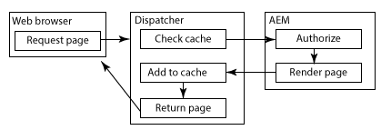

# 缓存受保护内容 {#caching-secured-content}

权限敏感型缓存允许您缓存受保护的页面。 Dispatcher在传送缓存的页面之前会检查用户对页面的访问权限。

Dispatcher包含可实施权限敏感型缓存的AuthChecker模块。 当模块被激活时，呈现器调用AEM Servlet以对所请求的内容执行用户身份验证和授权。 Servlet响应确定内容是否被传送到Web浏览器。

由于身份验证和授权方法特定于AEM部署，因此您需要创建Servlet。

>[!NOTE]
>
>使用`deny`过滤器来强制实施一揽子安全限制。 对配置为允许访问用户或组子集的页面使用权限敏感型缓存。

下图说明了当Web浏览器请求使用权限敏感型缓存的页面时发生事件的顺序。

## 页面已缓存且用户已授权{#page-is-cached-and-user-is-authorized}


1. Dispatcher确定所请求的内容是否已缓存且有效。
1. Dispatcher向呈现器发送请求消息。 HEAD部分包含浏览器请求中的所有标题行。
1. 呈现器调用授权程序以执行安全检查并响应Dispatcher。 响应消息包括HTTP状态代码200，以指示用户已获得授权。
1. Dispatcher向浏览器发送响应消息，该浏览器包含呈现响应中的标头行和主体中的缓存内容。

## 页面未缓存且用户已获得授权{#page-is-not-cached-and-user-is-authorized}



1. Dispatcher确定内容未缓存或需要更新。
1. Dispatcher将原始请求转发到渲染器。
1. 呈现器调用授权程序Servlet以执行安全检查。 授权用户后，呈现器将呈现的页面包含在响应消息的正文中。
1. Dispatcher将响应转发到浏览器。 Dispatcher将呈现器响应消息的正文添加到缓存。

## 未授权用户{#user-is-not-authorized}


1. Dispatcher检查缓存。
1. Dispatcher向呈现器发送一条请求消息，该消息包含来自浏览器请求的所有标头行。
1. 呈现器调用授权程序Servlet以执行安全检查失败，并且呈现器将原始请求转发到Dispatcher。

## 实施权限敏感型缓存{#implementing-permission-sensitive-caching}

要实施权限敏感型缓存，请执行以下任务：

* 开发执行身份验证和授权的Servlet
* 配置Dispatcher

>[!NOTE]
>
>通常，安全资源存储在与不安全文件不同的文件夹中。 例如， /content/secure/


## 创建授权Servlet {#create-the-authorization-servlet}

创建并部署Servlet，以对请求Web内容的用户执行身份验证和授权。 Servlet可以使用任何身份验证和授权方法，如AEM用户帐户和存储库ACL或LDAP查找服务。 您将Servlet部署到Dispatcher用作呈现器的AEM实例。

Servlet必须可供所有用户访问。 因此，Servlet应扩展`org.apache.sling.api.servlets.SlingSafeMethodsServlet`类，该类提供对系统的只读访问。

Servlet只接收呈现器中的HEAD请求，因此您只需实施`doHead`方法。

呈现器将请求资源的URI作为HTTP请求的参数包含在内。 例如，通过`/bin/permissioncheck`访问授权Servlet。 要在/content/geometrixx-outdoors/en.html页面上执行安全检查，渲染器在HTTP请求中包含以下URL:

`/bin/permissioncheck?uri=/content/geometrixx-outdoors/en.html`

Servlet响应消息必须包含以下HTTP状态代码：

* 200:已传递身份验证和授权。

以下示例Servlet从HTTP请求中获取所请求资源的URL。 该代码使用Felix SCR `Property`注释将`sling.servlet.paths`属性的值设置为/bin/permissioncheck。 在`doHead`方法中，Servlet获取会话对象，并使用`checkPermission`方法确定相应的响应代码。

>[!NOTE]
>
>必须在Sling Servlet解析程序(org.apache.sling.servlets.resolver.SlingServletResolver)服务中启用sling.servlet.paths属性的值。

### 示例Servlet {#example-servlet}

```java
package com.adobe.example;

import org.apache.felix.scr.annotations.Component;
import org.apache.felix.scr.annotations.Service;
import org.apache.felix.scr.annotations.Property;

import org.apache.sling.api.SlingHttpServletRequest;
import org.apache.sling.api.SlingHttpServletResponse;
import org.apache.sling.api.servlets.SlingSafeMethodsServlet;

import org.slf4j.Logger;
import org.slf4j.LoggerFactory;

import javax.jcr.Session;

@Component(metatype=false)
@Service
public class AuthcheckerServlet extends SlingSafeMethodsServlet {
 
    @Property(value="/bin/permissioncheck")
    static final String SERVLET_PATH="sling.servlet.paths";
    
    private Logger logger = LoggerFactory.getLogger(this.getClass());
    
    public void doHead(SlingHttpServletRequest request, SlingHttpServletResponse response) {
     try{ 
      //retrieve the requested URL
      String uri = request.getParameter("uri");
      //obtain the session from the request
      Session session = request.getResourceResolver().adaptTo(javax.jcr.Session.class);     
      //perform the permissions check
      try {
       session.checkPermission(uri, Session.ACTION_READ);
       logger.info("authchecker says OK");
       response.setStatus(SlingHttpServletResponse.SC_OK);
      } catch(Exception e) {
       logger.info("authchecker says READ access DENIED!");
       response.setStatus(SlingHttpServletResponse.SC_FORBIDDEN);
      }
     }catch(Exception e){
      logger.error("authchecker servlet exception: " + e.getMessage());
     }
    }
}
```

## 为权限敏感型缓存{#configure-dispatcher-for-permission-sensitive-caching}配置Dispatcher

dispatcher.any文件的auth_checker部分控制对权限敏感的缓存行为。 auth_checker部分包括以下子部分：

* `url`:执行安全检 `sling.servlet.paths` 查的Servlet属性的值。

* `filter`:指定对权限敏感的缓存应用到的文件夹的过滤器。通常，`deny`过滤器会应用于所有文件夹，而`allow`过滤器会应用于安全文件夹。

* `headers`:指定授权Servlet在响应中包含的HTTP标头。

当Dispatcher启动时，Dispatcher日志文件包含以下调试级别消息：

`AuthChecker: initialized with URL 'configured_url'.`

以下示例auth_checker部分将Dispatcher配置为使用前一个主题的servlet。 过滤器部分仅对安全HTML资源执行权限检查。

### 示例配置{#example-configuration}

```xml
/auth_checker
  {
  # request is sent to this URL with '?uri=<page>' appended
  /url "/bin/permissioncheck"
      
  # only the requested pages matching the filter section below are checked,
  # all other pages get delivered unchecked
  /filter
    {
    /0000
      {
      /glob "*"
      /type "deny"
      }
    /0001
      {
      /glob "/content/secure/*.html"
      /type "allow"
      }
    }
  # any header line returned from the auth_checker's HEAD request matching
  # the section below will be returned as well
  /headers
    {
    /0000
      {
      /glob "*"
      /type "deny"
      }
    /0001
      {
      /glob "Set-Cookie:*"
      /type "allow"
      }
    }
  }
```
